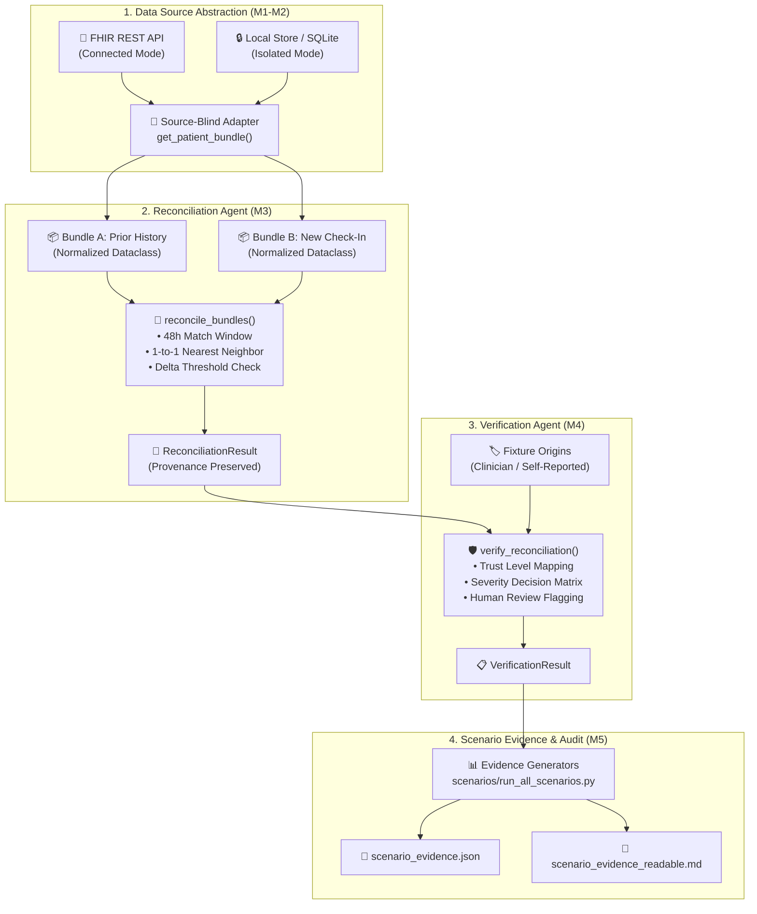
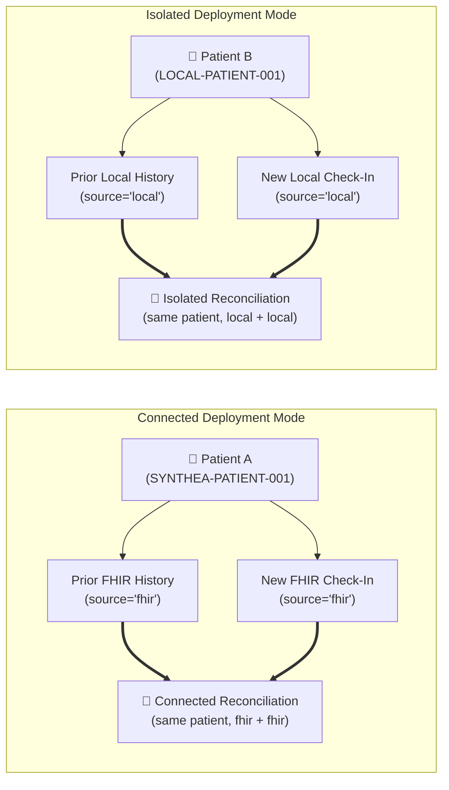
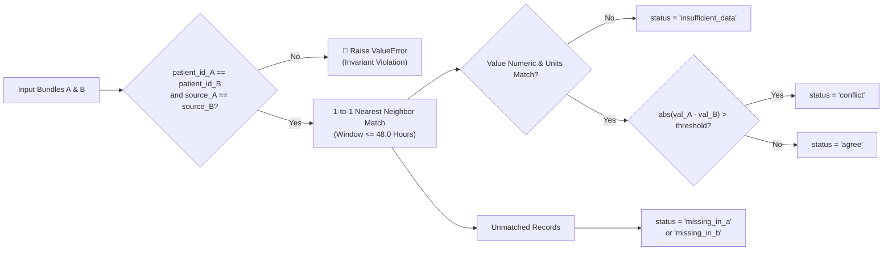
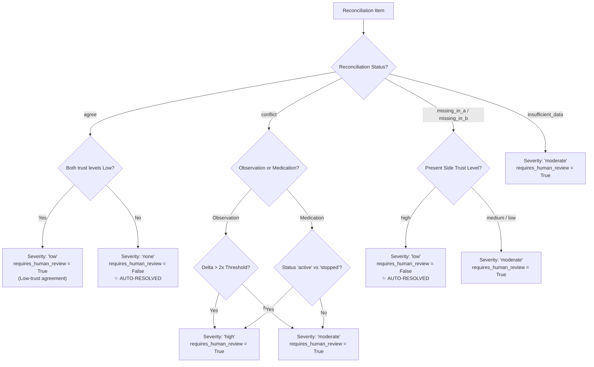

# 🏥 ChronicCare AI — Clinical Data Reconciliation & Verification Platform (POC)

[](https://www.python.org/)
[](https://r4.smarthealthit.org/)
[](https://www.sqlite.org/)
[]()
[]()
[]()

> **Proof-of-Concept Scope**: ChronicCare AI is a clinical decision-support system POC testing a trust-aware **Reconciliation → Verification** pipeline for chronic disease management across two distinct patient deployment modes: **Connected Mode** (FHIR/EHR API) and **Isolated Mode** (Local SQLite Store).

---

## 🌟 Executive Summary & Key Architecture

ChronicCare AI addresses data inconsistency and trust management when combining existing patient clinical histories with incoming patient check-ins. Rather than relying on non-deterministic LLMs or clinical risk engines for core data handling, this platform provides a **100% deterministic, rule-based pipeline** that normalizes records, reconciles observation and medication deltas, assigns source-aware trust levels, and evaluates risk severity to safely distinguish **auto-resolvable updates** from cases requiring **human clinical review**.



---

## 🎯 Deployment Modes vs. Reconciliation Topologies

### 1. Architectural Distinction (Deployment Modes)
In ChronicCare AI, a patient belongs to one of two deployment architecture cases:

- **Connected Mode 🏥**: The patient has an accessible EHR at their healthcare provider (represented via SMART Health IT FHIR R4 sandbox for the POC). All clinical data originates from `source = "fhir"`.
- **Isolated Mode 🔒**: The patient does NOT have an accessible FHIR/EHR source (e.g., offline or air-gapped). Their records exist in our Local Store (`source = "local"`).

> [!IMPORTANT]
> **Core Identity Invariant (`Patient A != Patient B`)**:
> FHIR Patient A and Local Store Patient B represent two **completely different individuals** in different deployment settings. They are never assigned the same `patient_id` or reconciled against each other.



### 2. Reconciliation Topology Invariants
Every reconciliation scenario in the codebase strictly satisfies four mandatory invariants:

1. **Identity Invariant**: `patient_id_A == patient_id_B` (must represent ONE actual patient).
2. **Store Invariant**: `source_A == source_B` (`"fhir" + "fhir"` OR `"local" + "local"`). Mixed sources (`fhir + local`) are strictly forbidden and rejected at runtime.
3. **Mode Invariant**: Each scenario runs in exactly one deployment mode (`connected` or `isolated`).
4. **Semantic Invariant**: Bundle A represents **prior/existing patient history**, and Bundle B represents a **new incoming check-in/report**.

---

## 🚀 Milestone Pipeline Architecture (M1–M5)

### 🔹 Milestone 1: Environment & Data-Source Foundation
- Scaffolding, dependency verification, and FHIR REST API connectivity (`https://r4.smarthealthit.org`).
- Local SQLite database creation (`local_store.db`) with `patients`, `observations`, and `medications` tables.
- Verification script: `python verify_m1.py`

### 🔹 Milestone 2: Source-Blind Data Abstraction Layer
- Exposes `get_patient_bundle(patient_id, mode)` in `data_sources/data_source.py`.
- Converts raw FHIR JSON bundles and SQLite rows into unified, immutable dataclasses:
  - `NormalizedPatient(patient_id, name, date_of_birth)`
  - `NormalizedObservation(patient_id, observation_type, value, unit, timestamp, source, source_record_id)`
  - `NormalizedMedication(patient_id, medication_name, status, dosage, timestamp, source, source_record_id)`
- Proves structural and type equivalence across sources without any mode-branching inside downstream consumers (`scenarios/test_source_blind.py`).
- Verification script: `python verify_m2.py`

---

### 🔹 Milestone 3: Deterministic Reconciliation Agent

The **Reconciliation Agent** (`agents/reconciliation_agent.py`) executes 1-to-1 nearest-neighbor timestamp matching within a strict 48-hour window and evaluates observation values against defined conflict thresholds.



#### Illustrative Conflict Thresholds (`OBSERVATION_CONFLICT_THRESHOLDS`)
> *(Illustrative POC threshold values only — NOT clinical guidance)*

| Observation Type | Conflict Threshold | Match Window |
| :--- | :---: | :---: |
| **Glucose** | `15.0 mg/dL` | `48.0 Hours` |
| **HbA1c** | `0.5 %` | `48.0 Hours` |
| **Systolic BP** | `10.0 mmHg` | `48.0 Hours` |
| **Diastolic BP** | `10.0 mmHg` | `48.0 Hours` |
| **Weight** | `2.0 kg` | `48.0 Hours` |

- Verification script: `python verify_m3.py`

---

### 🔹 Milestone 4: Trust-Aware Verification Agent

The **Verification Agent** (`agents/verification_agent.py`) consumes M3's `ReconciliationResult` and applies deterministic trust mappings and severity rules to assign risk severity (`"none"`, `"low"`, `"moderate"`, `"high"`), human review flags (`requires_human_review = True/False`), and auditable `review_reason` strings.

#### Trust Level Hierarchy (`TRUST_LEVELS`)
- **`fhir` source** $\rightarrow$ `"high"` trust by default
- **`local` source** $\rightarrow$ `"medium"` trust by default
- **`local_clinician_entered`** $\rightarrow$ `"high"` trust
- **`local_ocr_or_upload`** $\rightarrow$ `"medium"` trust
- **`local_self_reported`** $\rightarrow$ `"low"` trust
- **Missing side (`source is None`)** $\rightarrow$ `None`

#### Deterministic Decision & Severity Matrix



- Verification script: `python verify_m4.py`

---

### 🔹 Milestone 5: Scenario Suite & Evidence Generation

Milestone 5 executes the end-to-end pipeline across the full scenario suite, captures structured evidence, and enforces 100% byte-for-byte reproducibility.

- Runner script: `python scenarios/run_all_scenarios.py`
- Structured JSON output: `output/scenario_evidence.json`
- Human-readable Markdown report: `output/scenario_evidence_readable.md`
- Formal FYP defense writeup: `POC_RESULTS.md`

---

## 📊 Defense Scenario Matrix & Verification Results

All 6 official scenarios plus 1 adversarial stress-test scenario pass cleanly under the corrected same-patient, same-mode architecture:

| Scenario ID | Scenario Name | Topology Mode | Key Conditions | Expected Outcome | Verification Summary | Verdict |
| :--- | :--- | :---: | :--- | :--- | :--- | :---: |
| `scenario_1` | **Scenario 1 — Clean/Connected** | Connected (`fhir + fhir`) | Prior FHIR history vs. new FHIR check-in; all deltas within threshold | All severity `"none"`, `requires_human_review = False` | `auto_resolved = 4, review = 0` | **PASS** |
| `scenario_2` | **Scenario 2 — Conflicting Observation** | Isolated (`local + local`) | Glucose (115 vs 175) & HbA1c (6.4 vs 8.1%) delta > 2x threshold | Severity `"high"`, `requires_human_review = True` | `auto_resolved = 0, review = 2` | **PASS** |
| `scenario_3a` | **Scenario 3A — Missing Med (High Trust)** | Connected (`fhir + fhir`) | Lisinopril 10mg present in FHIR prior state (high trust), missing in check-in | Severity `"low"`, `requires_human_review = False` | `auto_resolved = 1, review = 0` | **PASS** |
| `scenario_3b` | **Scenario 3B — Missing Med (Low Trust)** | Isolated (`local + local`) | Lisinopril 10mg present only in check-in (`local_self_reported` = low trust) | Severity `"moderate"`, `requires_human_review = True` | `auto_resolved = 0, review = 1` | **PASS** |
| `scenario_4a` | **Scenario 4A — Trust Metadata (Both High)** | Isolated (`local + local`) | Glucose conflict (delta 55); both sides `local_clinician_entered` (high trust) | Both `high` trust, severity `"high"`, review=`True` | `trust_a=high, trust_b=high` | **PASS** |
| `scenario_4b` | **Scenario 4B — Trust Metadata (One Low)** | Isolated (`local + local`) | Glucose conflict (delta 55); Side B `local_self_reported` (low trust) | `trust_a=high, trust_b=low`, severity `"high"`, review=`True` | `trust_a=high, trust_b=low` | **PASS** |
| `scenario_c1` | **Adversarial C1 — Med Dosage Mismatch** | Isolated (`local + local`) | Metformin 500mg active on both sides; dosage string mismatch | Severity `"moderate"`, `requires_human_review = True` | `auto_resolved = 0, review = 1` | **PASS** |

---

## 🛠️ Installation & Execution Guide

### 1. Prerequisites & Environment Setup
- **Python Version**: Python 3.9+
- **Dependencies**: `requests`, `python-dotenv`

```bash
# Clone the repository
git clone https://github.com/UsmanBari/ChronicCare-AI.git
cd ChronicCare-AI

# Install dependencies
pip install -r requirements.txt
```

### 2. Execute Full End-to-End Pipeline & Generate Evidence
```bash
python scenarios/run_all_scenarios.py
```

### 3. Run Individual Milestone Verifications
```bash
python verify_m1.py
python verify_m2.py
python verify_m3.py
python verify_m4.py
```

### 4. Verify 100% Byte-for-Byte Reproducibility
```bash
python -c "import os, sys, subprocess; root='.'; j_path=os.path.join(root,'output/scenario_evidence.json'); md_path=os.path.join(root,'output/scenario_evidence_readable.md'); j1=open(j_path,'rb').read(); md1=open(md_path,'rb').read(); res=subprocess.run([sys.executable, os.path.join(root,'scenarios/run_all_scenarios.py')], stdout=subprocess.PIPE, stderr=subprocess.PIPE); j2=open(j_path,'rb').read(); md2=open(md_path,'rb').read(); print('RUN 2 EXIT CODE:', res.returncode); print('JSON BYTE IDENTICAL:', j1 == j2); print('MD BYTE IDENTICAL:', md1 == md2)"
```

---

## 🛡️ Non-Clinical & Scope Declarations

> [!NOTE]
> - **No Clinical Triage or Treatment Selection**: The Reconciliation and Verification agents identify data conflicts, assess trust, and flag human review necessity. They do **not** select winning clinical values, prescribe medications, or make triage decisions.
> - **Zero Core LLM Dependency**: The pipeline is 100% deterministic and rule-based, guaranteeing reproducible outputs for auditability.
> - **Synthetic Test Data**: All scenario bundles use synthetic Synthea or fictional test data. No real patient PHI is stored or processed.
