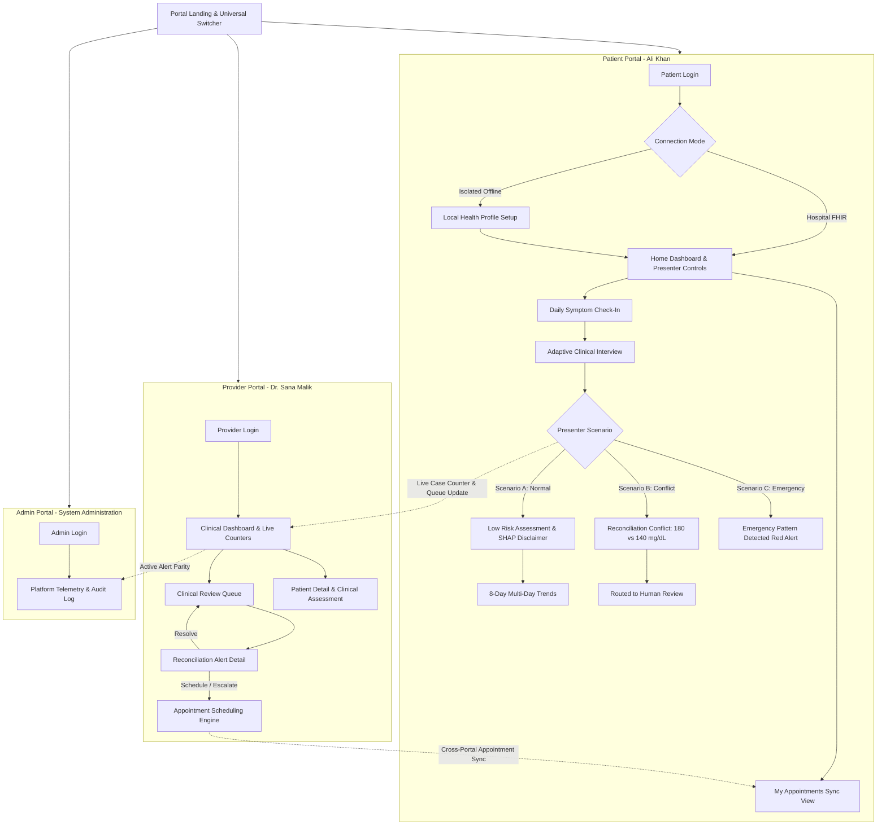
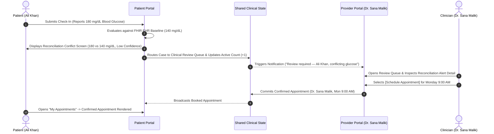

# ChronicCare AI

> **Interactive Multi-Portal Frontend Prototype for Agentic Chronic Disease Management**

[](https://nextjs.org/)
[](https://react.dev/)
[](https://www.typescriptlang.org/)
[](https://tailwindcss.com/)

---

## ⚠️ Important Disclaimer

> **This is a high-fidelity interactive UI prototype with MOCKED computational behavior, built for an FYP proposal defense.**
>
> It demonstrates the interface, interaction workflows, and multi-portal clinical ergonomics for ChronicCare AI. There is no live backend, trained AI/ML inference, real HL7® FHIR® network integration, or live authentication in this repository. All clinical telemetry, audit records, and risk results are seeded or simulated.
>
> The core algorithmic reconciliation and verification logic (Conflict Resolution and Clinical Consistency Protocol) exists and was separately validated in our foundational technical proof of concept.

---

## 🔬 What is Real vs. Mocked

To provide transparent technical clarity for examiners and clinical reviewers, the table below delineates the functional boundary between the active interactive UI layer and simulated computational backends:

| Dimension | Real & Interactive in this Prototype | Mocked / Simulated for Demonstration |
|---|---|---|
| **User Interface & Layout** | Complete responsive React UI (desktop, tablet, mobile down to 375px), modal overlays, slide-up drawers, bilingual typography. | None — all screens and layout containers are fully rendered components. |
| **State Management** | Centralized React Context (`AppContext`) managing multi-portal navigation, form inputs, dynamic case counters, and cross-portal state sync. | Backend database persistence (data resets upon full page refresh). |
| **Form & Input Validation** | Live debounced voice input simulation, multi-branch question gating, input requirement validation, checkbox logic. | Real automatic speech recognition (ASR) cloud transcription API. |
| **Localization** | Native bidirectional bilingual dictionary engine with instant toggle between English and Urdu (اردو) across every screen. | Machine translation API (translations are curated statically). |
| **Clinical Discrepancy Flow** | Live deterministic scenario branching (Normal, Conflict, Emergency) via Presenter Controls, triggering dynamic triage states. | Real-time clinical ML risk inference models and automated SHAP value generation. |
| **Cross-Portal Sync** | Provider appointment booking dynamically writes to shared state and immediately renders in the Patient Portal's appointment view. | Live enterprise calendar sync / SMS / push notification delivery services. |
| **EHR Connectivity** | Interactive dual connection path (HL7® FHIR® network simulation vs. Isolated Offline Local Store profile creation). | Live TLS authenticated SMART on FHIR endpoint connectivity. |
| **Resilience & Safety** | Custom top-level React `ErrorBoundary` with client diagnostic reporting and full reset recovery capabilities. | Real-time automated clinical safety incident escalation to 911/EMS dispatch. |

---

## 📖 Overview

**ChronicCare AI** is an intelligent chronic disease management platform designed to support patients with **Type 2 Diabetes (T2D)** and **Hypertension (HTN)** alongside their healthcare providers and clinical administrators. Managing chronic conditions requires continuous daily patient engagement, accurate data reconciliation between self-reported observations and electronic health records (EHR), and immediate clinical safety escalation.

This interactive frontend prototype demonstrates the end-to-end user experience across all primary clinical stakeholders:
- **Patients**: Engaging with adaptive conversational symptom check-ins, multi-day trend visualizations, localized bilingual accessibility (English & اردو), and follow-up appointment tracking.
- **Healthcare Providers**: Triage dashboards, live dynamic case counters, clinical review queues for data reconciliation, and direct consultation scheduling.
- **System Administrators**: Platform telemetry monitoring, user access directory, and compliance audit trail inspection.

The application showcases the complete intended clinical workflow, including our dual-mode architecture (Hospital FHIR EHR vs. Isolated Local Store) and safety guardrails, within a responsive and unified visual environment.

---

## 🏗️ Architecture

### System Topology & Multi-Portal Structure



The three-portal architecture directly mirrors the modular decomposition proposed for ChronicCare AI: empowering autonomous patient self-monitoring, providing clinicians with high-signal triage tools without alert fatigue, and giving institutional administrators total governance over integration health and compliance auditability.

### Reconciliation & Triage Sequence (Scenario B: Conflict)

The sequence diagram below details the flagship cross-portal reconciliation workflow demonstrated in this prototype:



---

## ✨ Features by Milestone

### Milestone 1 (M1) — Daily Symptom Check-In Flow
- Dual connection modes: Simulated HL7® FHIR® EHR handshake vs. Isolated Offline Local Store profile setup.
- Conversational check-in with free-form text and a 2-second animated voice dictation simulation.
- Adaptive branching interview (Question 1 Thirst $\rightarrow$ Question 2 Urination; Question 3 Medication Adherence with low confidence tracking).
- Bilingual language engine supporting instant switching between English and Urdu (اردو).

### Milestone 2 (M2) — Processing, Risk Assessment & Trend Visualization
- 2.2-second animated clinical processing state with a 1.0-second *"✓ Clinical Assessment Verified"* flash.
- Presentational `RiskBadge` component rendering `riskLevel="low"`.
- *"Why"* Contributing Factors panel with mandatory SHAP explanation safeguard disclaimer.
- 3 multi-day Recharts trend charts (Blood Glucose, Blood Pressure, Medication Adherence).

### Milestone 3 (M3) — Presenter Controls & Multi-Path Scenario Branching
- Dashed Presenter Controls box on Patient Home for live deterministic scenario switching.
- **Scenario A (Normal)**: Full healthy baseline risk and trend pathway.
- **Scenario B (Conflict)**: Discrepancy comparison (180 mg/dL self-reported vs. 140 mg/dL FHIR record) $\rightarrow$ Low Confidence / Routed to Human Review.
- **Scenario C (Emergency)**: Urgency-optimized 1.0s processing $\rightarrow$ Dedicated Red Emergency Pattern Detected screen without RiskBadge.
- Safe `returnToHomeAndClearRun` reset mechanics preventing stale data bleed.

### Milestone 4 (M4) — Multi-Portal Suite & Cross-Portal Synchronization
- Root Portal Landing screen and unified Header Portal Switcher.
- Provider Dashboard with live reactive counters (*Active Cases*, *Urgent Cases*) and notification feeds.
- Clinical Review Queue table with baseline patient (Sara Ahmed) and dynamic scenario rows (Ali Khan).
- Reconciliation Alert Detail with dual source cards and 3 action buttons: `[Resolve]`, `[Schedule Appointment]`, `[Escalate]`.
- Provider appointment scheduling engine synchronized directly to Patient Portal's *"My Appointments"* view.
- Admin Portal featuring platform telemetry counters (126 Users, 18 Providers, 108 Patients, Active Alerts) and compliance audit logs.
- Globally accessible Unified Settings modal.

### Milestone 5 (M5) — Integration, Polish & Live Demonstration
- Animated highlight flash transitions on Provider and Admin live counters.
- Explicit visual Isolated Mode banner on Patient Home when offline store is active.
- Graceful empty state indicator on Trend Screen when accessed prior to daily check-in.
- Full 8-path regression verification and bilingual audit across all screens.
- Presenter live demo script cue sheet (`DEMO_SCRIPT.md`).

---

## 🎭 Demo Scenarios

The prototype features a dedicated **Presenter Controls** panel on the Patient Home screen to demonstrate three deterministic clinical pathways:

1. **Scenario A: Normal**
   - *Concept*: Routine stable check-in.
   - *Outcome*: 🟢 Low Risk assessment, contributing factors panel, and 8-day stability trends. Provider dashboard reflects 2 baseline active cases and 0 urgent cases.
2. **Scenario B: Conflict**
   - *Concept*: Cross-source data inconsistency requiring clinician oversight.
   - *Outcome*: Highlights a conflict between patient-reported glucose (180 mg/dL) and hospital FHIR telemetry (140 mg/dL). Routes to Provider Review Queue for resolution or appointment booking.
3. **Scenario C: Emergency**
   - *Concept*: Acute symptom escalation.
   - *Outcome*: Urgent 1.0s processing triggers a critical red emergency guidance screen. Instantly raises Provider Urgent Cases counter to 🔴 1 and updates Admin Active Alerts.

*For complete click-by-click presenter instructions, see [`DEMO_SCRIPT.md`](./DEMO_SCRIPT.md).*

---

## 🧪 Testing & Quality Assurance

A comprehensive 25-point manual QA regression audit was conducted across all three portals to validate functional boundaries, accessibility, and system resilience:

- **Regression Coverage**: Verified input validation on all login forms, dual-path connection initialization, 4-way adaptive interview branching, 375px mobile chart responsiveness, and 6-way portal switcher combinations.
- **Accessibility & DEI Standards**: Validated that all clinical triage states (Low Risk, Discrepancy, Emergency) use multi-modal signaling combining geometric shape icons, explicit typography, and color tokens to ensure full usability for colorblind reviewers.
- **Client Resilience**: Verified application stability under rapid action double-clicking, browser state resets, and top-level React `ErrorBoundary` interception to eliminate live presentation risk.

---

## 🚀 Getting Started

### Prerequisites
- **Node.js**: `v18.0.0` or higher
- **npm**: `v9.0.0` or higher

### Installation
```bash
# 1. Clone repository
git clone https://github.com/UsmanBari/ChronicCare-AI.git
cd ChronicCare-AI

# 2. Install dependencies
npm install

# 3. Start local development server
npm run dev
```

Open [http://localhost:3000](http://localhost:3000) in your browser to interact with the prototype.

---

## 🎨 Design System

### Palette & Color Tokens

| Token | Hex Value | Preview | Usage |
|---|---|:---:|---|
| **Primary Navy** | `#16233F` | `■` | Primary headers, hero cards, dark navigation elements |
| **Accent Teal** | `#0B6E70` | `■` | Primary buttons, active highlights, health telemetry |
| **Supporting Amber** | `#8A5A18` | `■` | Clinical review warnings, conflict tags, offline badges |
| **Muted Green** | `#24623F` | `■` | Low risk indicators, resolved cases, verification checkmarks |

### Multi-Modal Triage Accessibility

To prevent reliance on color alone for safety-critical clinical triage, all status indicators combine color, shape, and text:
- **Stable / Verified**: Boxed green container with `CheckCircle2` icon + explicit *"Stable"* / *"Low Risk"* label.
- **Discrepancy / Review Required**: Boxed amber container with `AlertTriangle` icon + explicit *"Discrepancy: Glucose 180 vs 140 mg/dL"* label.
- **Critical / Emergency**: Boxed red container with `AlertOctagon` icon + explicit *"Critical: High-Risk Pattern Alerted"* label.

### Typography & Localization
- **Typography**: Editorial serif headings (`Cambria`, `Georgia`, serif; `Noto Nastaliq Urdu` for Urdu) paired with clean sans-serif body typography (`Inter`, system-ui).
- **Localization**: Native bilingual dictionary toggle supporting English and Urdu (اردو) across all components.

---

## 📁 Project Structure

```text
ChronicCare-AI/
├── DEMO_SCRIPT.md                               # Live presenter click-by-click cue sheet
├── README.md                                    # Project documentation
├── next.config.mjs                              # Next.js configuration
├── package.json                                 # Project dependencies and scripts
├── postcss.config.mjs                           # PostCSS configuration
├── tailwind.config.ts                           # Tailwind CSS theme & color tokens
├── tsconfig.json                                # TypeScript configuration
└── app/
    ├── globals.css                              # Core CSS & animation utilities
    ├── layout.tsx                               # Root layout & font definitions
    ├── page.tsx                                 # Master portal & screen router
    ├── components/
    │   ├── AdaptiveInterviewScreen.tsx          # Multi-branch adaptive question flow
    │   ├── CheckInEntryScreen.tsx               # Symptom text & voice input entry
    │   ├── ConfirmationScreen.tsx               # Check-in submission receipt
    │   ├── ConflictScreen.tsx                   # Reconciliation discrepancy card (180 vs 140)
    │   ├── ConnectionScreen.tsx                 # Dual-mode selection (FHIR vs. Local)
    │   ├── DemoFooter.tsx                       # Global "DEMO — DATA NOT REAL" watermark
    │   ├── EmergencyScreen.tsx                  # Red alert emergency guidance view
    │   ├── ErrorBoundary.tsx                    # Top-level client error resilience boundary
    │   ├── Header.tsx                           # Global header & quick portal switcher
    │   ├── HealthProfileScreen.tsx              # Offline profile setup form
    │   ├── HomeScreen.tsx                       # Patient dashboard & Presenter Controls
    │   ├── LoginScreen.tsx                      # Patient portal authentication
    │   ├── PatientAppointmentsScreen.tsx        # Confirmed appointments patient view
    │   ├── PortalLandingScreen.tsx              # 3-way portal entry screen
    │   ├── ProcessingScreen.tsx                 # Simulated clinical analysis & verified flash
    │   ├── RiskBadge.tsx                        # Presentational risk tier badge
    │   ├── RiskResultScreen.tsx                 # Assessment result & SHAP disclaimer
    │   ├── RoutedToReviewScreen.tsx             # Low confidence human triage notice
    │   ├── TrendScreen.tsx                      # 8-day multi-observation trend charts
    │   ├── UnifiedSettingsModal.tsx             # Shared settings & connection status
    │   ├── admin/
    │   │   ├── AdminDashboardScreen.tsx         # Telemetry statistics & audit log
    │   │   └── AdminLoginScreen.tsx             # Administrator authentication
    │   └── provider/
    │       ├── AppointmentSchedulingScreen.tsx  # Follow-up slot booking engine
    │       ├── PatientDetailScreen.tsx          # Longitudinal case assessment & acknowledge
    │       ├── ProviderDashboardScreen.tsx      # Provider triage dashboard & live counters
    │       ├── ProviderLoginScreen.tsx          # Clinician authentication
    │       ├── ReconciliationAlertDetail.tsx    # Discrepancy analysis & triage actions
    │       └── ReviewQueueScreen.tsx            # Multi-case clinical review queue table
    ├── context/
    │   └── AppContext.tsx                       # Global multi-portal state management
    └── translations/
        └── index.ts                             # Bilingual translation dictionary (EN/UR)
```

---

## 🗺️ Roadmap

Following the completion of this interface prototype, future project milestones will implement the computational and clinical intelligence layers:

1. **Risk Prediction Engine**: Integrating trained machine learning classifiers to generate predictive risk assessments from real longitudinal patient check-in data.
2. **Real HL7® FHIR® Connectivity**: Establishing authenticated SMART on FHIR integrations with certified electronic health record systems.
3. **Multi-Agent Verification & Reconciliation**: Deploying our autonomous Verification Agent architecture to conduct automated clinical safety checks and data conflict resolution.
4. **Clinical Evaluation & Volunteer Pilot**: Conducting structured usability trials and clinical safety audits with chronic disease management cohorts.

---

## 👥 Team

**Department of Computer Science — FAST National University of Computer and Emerging Sciences (FAST-NUCES)**

| Name | Role / Core Responsibilities |
|---|---|
| **Usman Bari** | Reasoning & ML core: orchestration, Verification Agent, Guideline RAG, both risk classifiers + preprocessing + SHAP, FHIR integration, system integration |
| **Hassaan Mudassar** | Interaction layer: Adaptive Interview, Reconciliation, Local Store (shared with Saad), Provider Dashboard, Admin UI |
| **Muhammad Saad** | Longitudinal reasoning & validation: Trend Analysis Agent, Patient App UI, Local Store (shared with Hassaan), evaluation framework & pilot coordination |

---

## 📌 Project Status

Academic Final Year Project (FYP) prototype developed for defense evaluation at FAST-NUCES (Fall 2026). Strictly for research and demonstration purposes; not approved for clinical diagnostic or commercial use.
